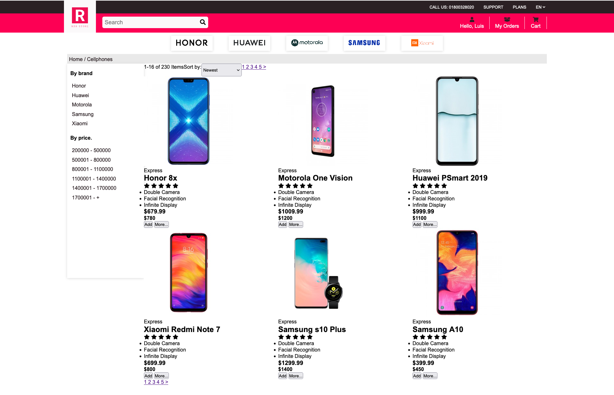

# Cellphones

This is my second attempt using HTML and CSS in a webpage.

## Table of contents

- [Overview](#overview)
  - [Screenshot](#screenshot)
  - [Links](#links)
- [My process](#my-process)
  - [Built with](#built-with)
  - [What I learned](#what-i-learned)
  - [Continued development](#continued-development)
- [Author](#author)

## Overview

### Screenshot

### Links

- Solution URL: [https://github.com/LuisCBeltran/cellphones](https://github.com/LuisCBeltran/cellphones)
- Live Site URL: [https://luiscbeltran.github.io/cellphones/](https://luiscbeltran.github.io/cellphones/)

## My process

### Built with

- HTML5
- CSS
- Flexbox
- Grid

### What I learned

I used grid for the first time in conjuction with flexbox.

### Continued development
I think I should continue learning about grid, I think it has great potential.

## Author

- Website - [Luis C. Beltrán](https://github.com/LuisCBeltran)
- Frontend Mentor - [@LuisCBeltran](https://www.frontendmentor.io/profile/LuisCBeltran)
- Twitter - [@luisc_beltran](https://twitter.com/luisc_beltran)
